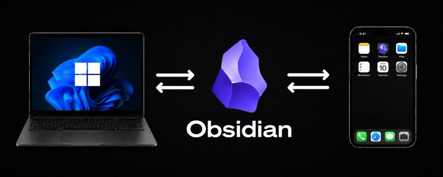

# Obsidian-through



随时随地在手机端 Obsidian 中写下一篇笔记，它都可以同步到电脑端 Obsidian 和 GitHub 私有仓库中。

Obsidian-through 会帮助完成整套同步环境的搭建，包括创建或连接 GitHub 私有仓库、上传现有笔记、配置 Windows 或 macOS 自动同步，以及指导移动端 Obsidian Git 连接到 GitHub。

你不需要学习复杂的 Git 命令，也不需要在不同教程之间反复查找配置方法。安装后，只需要说明你想实现 Obsidian 多端同步，工具就会按照完整流程进行配置、检查和问题修复。

---

## 它能做什么？

### 一键完成电脑端配置

运行一次 `npx obsidian-through`，它会自动识别 Windows 或 macOS，检查并安装 Git、GitHub CLI 等必要工具，打开 GitHub 网页登录，定位本地 Obsidian 笔记库，并完成 GitHub 私有仓库连接。

### 处理不同的笔记与仓库状态

* 本地有笔记、GitHub 没有仓库：创建私有仓库并上传现有笔记
* GitHub 已有仓库、新电脑没有笔记：连接并拉取已有笔记库
* 本地和 GitHub 都有笔记：创建保护分支后安全合并，不强制覆盖任何一边
* 仓库已经连接：检查远端、分支、提交状态和私有权限后继续配置

### Windows 自动同步

Windows 使用隐藏事件监听器监控笔记的新增、修改、删除和重命名。停止编辑约 15 秒后自动提交并推送，工作区干净时每 30 秒静默拉取其他设备的更新。监听器支持开机登录自启、断网后补推和异常停止后自动恢复，不会反复弹出命令行窗口。

### macOS 自动同步

macOS 使用原生 Git、GitHub CLI 和 Obsidian Git。工具会完成仓库连接和插件自动同步配置，支持停止编辑后提交、启动 Obsidian 时 Pull，并避免安装 Windows 专用的计划任务与监听器。

### 手机和平板接入

移动端使用统一流程，不需要区分 iPhone、iPad 或 Android 教程。Obsidian-through 会生成当前用户专属的 GitHub 账号、私有仓库、HTTPS 克隆地址、仓库名和提交邮箱，并逐步指导：

* 安装并启用 Obsidian Git
* 创建仅能访问指定笔记仓库的 Fine-grained Token
* 填写 Username、Token、Author name 和 Author email
* 克隆已有私有仓库并完成首次 Pull 与 Commit-and-sync
* 配置停止编辑约 30 秒后的自动同步和启动 Pull

### 检查、修复与恢复

* 诊断 Pull、Push、认证、Token、VPN 和网络错误
* 修复远端分支、upstream、路径、重复笔记和合并冲突
* 检查 Windows 监听器与 Watchdog 是否真实运行
* 从 Git 提交历史恢复误删或被覆盖的笔记
* 验证电脑、GitHub 和移动设备之间的双向同步

### 保护笔记与设备设置

笔记默认进入 GitHub 私有仓库。设备专属的 Obsidian 工作区、缓存和 Git 插件认证配置不会被同步到其他设备，避免电脑与手机互相覆盖设置。所有流程禁止强推，也不会要求用户把密码、验证码或 Token 发到聊天中。

---

## 你最终会得到

```text
Windows / macOS Obsidian
          ↕
   GitHub 私有仓库
          ↕
  手机 / 平板 Obsidian
```

电脑端负责稳定的自动提交和拉取，GitHub 保存完整版本历史，移动端可以随时查看、编辑并同步同一套 Markdown 笔记。

---

## 安装方法

请先确保电脑已经安装 Node.js 18 或更高版本。

推荐使用：

```bash
npx obsidian-through
```

查看可用命令：

```bash
npx obsidian-through help
```

查看当前系统会使用的同步方式：

```bash
npx obsidian-through platform
```

常用命令：

```bash
npx obsidian-through login
npx obsidian-through publish --vault "C:\path\to\vault" --repo https://github.com/owner/private-vault.git --open
npx obsidian-through verify --vault "C:\path\to\vault"
npx obsidian-through mobile-info --vault "C:\path\to\vault" --open-token-page
```

如果当前运行环境不支持 npm 包安装，也可以直接把此 GitHub 仓库链接交给支持读取 GitHub 仓库的 AI 工具，让它使用仓库中的 `SKILL.md`、`scripts/` 和 `references/`。

---

## GitHub 连接优化

配置时不要反复手动拆分 owner、仓库名和 `.git` 地址。

可以直接提供 GitHub 仓库网址：

```text
https://github.com/owner/private-vault
```

或：

```text
https://github.com/owner/private-vault.git
```

然后运行：

```bash
npx obsidian-through publish --vault "C:\path\to\vault" --repo https://github.com/owner/private-vault.git --open
```

`--open` 会打开目标 GitHub 仓库页面或新建仓库页面，方便确认当前连接的是正确的私有仓库。

如果 GitHub 登录失败，先运行：

```bash
npx obsidian-through login
```

网络需要代理时：

```bash
npx obsidian-through login --proxy http://127.0.0.1:7890
```

登录过程中不需要把 GitHub 密码、验证码或 Token 发到聊天窗口。

---

## 使用方法

配置电脑端同步：

```text
使用 obsidian-through，帮我配置电脑端 Obsidian、GitHub 私有仓库和手机端 Obsidian 同步。
```

检查已有同步：

```text
使用 obsidian-through，帮我检查并修复 Obsidian Git 同步问题。
```

恢复误删笔记：

```text
使用 obsidian-through，帮我恢复误删的 Obsidian 笔记。
```

---

## 注意事项

* 笔记默认应上传到 GitHub 私有仓库
* 上传前必须确认本地笔记库路径和目标仓库
* 不要将 GitHub Token 发送到聊天窗口、笔记、截图或仓库 URL
* 手机端可能无法长期在后台自动运行同步
* 建议手机开始编辑前执行 Pull
* 编辑完成后执行 Commit-and-sync
* 不建议同时使用 Git 和 iCloud 同步同一个笔记库
* 尽量避免多台设备同时修改同一篇笔记
* 测试删除时使用测试笔记，不要直接测试正式稿

---

## 说明

Obsidian-through 不是新的 Obsidian 同步插件。

它是一个帮助搭建、检查和修复 Obsidian Git 同步环境的工作流。

实际的笔记同步由 Obsidian Git、GitHub 和本地 Git 完成，Obsidian-through 负责帮助正确完成整套配置流程。

---

# English Version

Write a note in Obsidian on your phone, then sync it to Obsidian on your computer and to a private GitHub repository.

Obsidian-through helps set up the complete synchronization environment: creating or connecting a private GitHub repository, uploading existing notes, configuring Windows or macOS automatic sync, and guiding mobile Obsidian Git setup.

You do not need to learn complex Git commands or combine multiple tutorials. After installation, describe the Obsidian sync you want, and the workflow can guide setup, verification, and repair.

---

## What can it do?

### One-command desktop setup

Run `npx obsidian-through` once. It detects Windows or macOS, checks and installs Git and GitHub CLI, opens GitHub web login, locates the local Obsidian vault, and connects it to a private GitHub repository.

### Handle every starting state

* Local notes with no GitHub repository: create a private repository and upload the vault
* Existing GitHub repository on a new computer: connect and pull the existing vault
* Notes on both sides: create a protection branch and merge safely without overwriting either side
* Existing connection: verify remote, branch, commit state, and private visibility before continuing

### Automatic Windows synchronization

A hidden Windows event watcher monitors note creation, edits, deletion, and renaming. It commits and pushes about 15 seconds after editing stops and silently pulls other-device updates every 30 seconds when the worktree is clean. It starts at login, retries after network recovery, restarts after failure, and does not flash command-line windows.

### Automatic macOS synchronization

On macOS, Obsidian-through uses native Git, GitHub CLI, and Obsidian Git. It connects the repository and configures post-edit synchronization and startup Pull without installing Windows-only scheduled tasks.

### Phones and tablets

One shared mobile workflow covers phones and tablets. Obsidian-through generates personalized values for the current GitHub account, private repository, HTTPS clone URL, repository name, and commit email, then guides the user through:

* Installing and enabling Obsidian Git
* Creating a fine-grained token limited to the selected notes repository
* Entering Username, Token, Author name, and Author email
* Cloning the private repository and completing the first Pull and Commit-and-sync
* Enabling synchronization about 30 seconds after edits stop and Pull on startup

### Diagnose, repair, and recover

* Diagnose Pull, Push, authentication, token, VPN, and network failures
* Repair remotes, upstream branches, paths, duplicate notes, and merge conflicts
* Verify that the Windows watcher and watchdog are genuinely running
* Recover deleted or overwritten notes from Git history
* Verify two-way synchronization across desktop, GitHub, and mobile

### Protect notes and device settings

Notes stay in a private GitHub repository. Device-specific Obsidian workspace, cache, and Git authentication settings remain local so computers and phones do not overwrite one another’s configuration. The workflow never force-pushes and never asks users to send passwords, verification codes, or tokens through chat.

---

## What you get

```text
Windows / macOS Obsidian
          ↕
 Private GitHub repository
          ↕
  Phone / tablet Obsidian
```

The desktop provides reliable automatic commit and pull, GitHub stores version history, and mobile devices can view, edit, and sync the same Markdown vault.

---

## Installation

Make sure Node.js 18 or newer is installed.

Recommended:

```bash
npx obsidian-through
```

Show commands:

```bash
npx obsidian-through help
```

Show the workflow selected for the current operating system:

```bash
npx obsidian-through platform
```

Common commands:

```bash
npx obsidian-through login
npx obsidian-through publish --vault "C:\path\to\vault" --repo https://github.com/owner/private-vault.git --open
npx obsidian-through verify --vault "C:\path\to\vault"
npx obsidian-through mobile-info --vault "C:\path\to\vault" --open-token-page
```

If npm package installation is not available in the current environment, provide this GitHub repository link to any AI tool that can read repositories and ask it to use `SKILL.md`, `scripts/`, and `references/`.

---

## GitHub connection

Do not repeatedly split owner, repository name, and `.git` URL by hand.

Use the repository URL directly:

```text
https://github.com/owner/private-vault
```

or:

```text
https://github.com/owner/private-vault.git
```

Then run:

```bash
npx obsidian-through publish --vault "C:\path\to\vault" --repo https://github.com/owner/private-vault.git --open
```

`--open` opens the target GitHub repository page or new repository page so the user can confirm the correct private repository.

If GitHub login fails, run:

```bash
npx obsidian-through login
```

If the network needs a proxy:

```bash
npx obsidian-through login --proxy http://127.0.0.1:7890
```

Never send GitHub passwords, verification codes, or tokens through chat.

---

## Notes

* Use a private GitHub repository for notes
* Confirm the local vault path and target repository before upload
* Never paste GitHub tokens into chat, notes, screenshots, or repository URLs
* Mobile automatic sync may not run continuously in the background
* Pull before editing on mobile
* Commit-and-sync after editing on mobile
* Do not use Git and iCloud to sync the same vault
* Avoid editing the same note on multiple devices at the same time
* Test deletion with test notes, not important drafts
